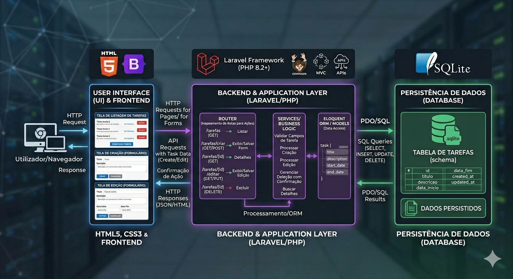
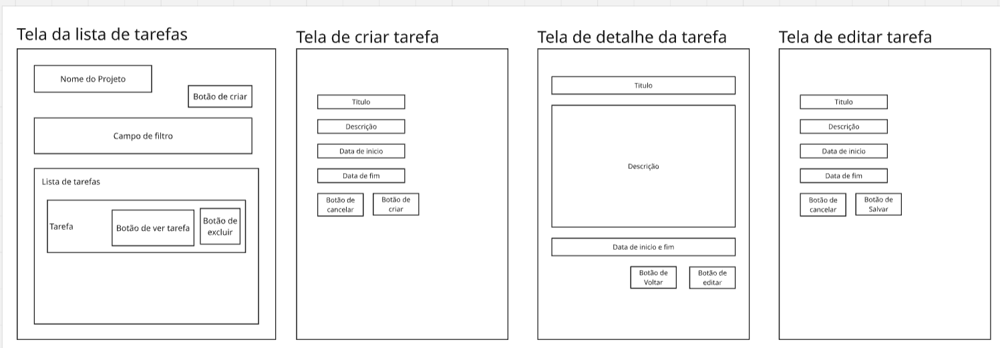

# Task Board

## 📑 Sumário

- [Objetivo da Aplicação](#objetivo-da-aplicação)
- [Interacoes Esperadas](#interacoes-esperadas)
- [Funcionalidades Principais](funcionalidades-principais)
- [Arquitetura](#arquitetura)
- [Telas / Componentes Principais](#telas--componentes-principais)
- [Campos do Formulario](#campos-do-formulario)
- [Rodando projeto via Docker](#-rodando-o-projeto-com-docker)
- [Comandos úteis](#%EF%B8%8F-comandos-úteis)
- [Rodando as migrations manualmente](#%EF%B8%8F-rodando-as-migrations-manualmente)
- [Configuracao inicial](#%EF%B8%8F-configuração-inicial)

---

## Objetivo da Aplicação
O objetivo do sistema é ajudar na organização e no gerenciamento de tarefas do dia a dia, permitindo que o usuário acompanhe suas atividades de forma simples, rápida e organizada.

---

## Interacoes Esperadas

### Cenário 001 - Criar tarefa com sucesso
**Dado** que o usuário está na tela de criação de tarefa  
**Quando** ele preenche o título "Estudar HTML"  
**E** adiciona a descrição "Praticar todos os dias por 2h"  
**E** define uma data de início e fim  
**E** clica em "Criar"  
**Então** a tarefa deve ser criada com sucesso  
**E** deve aparecer na lista de tarefas  

---

### Cenário 002 - Listar tarefas
**Dado** que o usuário possui tarefas cadastradas  
**Quando** ele acessa a tela de lista de tarefas  
**Então** o sistema deve exibir todas as tarefas  
**E** cada tarefa deve apresentar:
- Título  
- Botão de visualizar  
- Botão de deletar  

---

### Cenário 003 - Filtrar tarefas por título
**Dado** que o usuário possui tarefas cadastradas  
**E** existe uma tarefa com o título "Estudar HTML"  
**Quando** ele digita "Estudar HTML" no campo de busca  
**Então** o sistema deve exibir apenas a tarefa "Estudar HTML"  

---

### Cenário 004 - Visualizar detalhe da tarefa
**Dado** que o usuário está na lista de tarefas  
**E** existe uma tarefa cadastrada  
**Quando** ele clica em uma tarefa  
**Então** o sistema deve exibir os detalhes da tarefa  
**E** mostrar:
- Título  
- Descrição  
- Datas  
- Botão de voltar  
- Botão de editar  

---

### Cenário 005 - Deletar tarefa
**Dado** que o usuário está na lista de tarefas  
**E** existe uma tarefa cadastrada com o título "Estudar HTML"  
**Quando** ele clica em "Excluir" na tarefa  
**E** confirma a exclusão  
**Então** a tarefa deve ser removida com sucesso  
**E** não deve mais aparecer na lista  

---

## Funcionalidades Principais
- Cadastrar tarefas  
- Editar tarefas  
- Excluir tarefas  
- Listar tarefas   

---

## Arquitetura
Divisão de camadas da aplicação:



---

## Telas / Componentes Principais
- Tela de criação de tarefa  
- Tela de lista de tarefas  
- Tela de detalhe da tarefa 

---

## Campos do Formulario
- **Titulo**
- **Descricao**
- **Data de inicio**
- **Data de fim**

---



---

## Próximas features
- Migrar o Front-end para React.
- Adicionar filtro com busca por titulo, data de criação, data de inicio e data fim.
- Adicionar tipos de ordenação na lista de tarefas.
- Adicionar status de A fazer,  Em andamento, Atrasado e Concluido.
- Adicionar autenticação com tela de login e cadastro de usuário.
- Adicionar categorias na criação de tarefas.

## 🐳 Rodando o projeto com Docker

### 📋 Pré-requisitos

* Docker instalado
* Docker Compose instalado

---

### 🚀 Subindo o ambiente

Clone o repositório e acesse a pasta:

```bash
git clone https://github.com/danilooliveira144/task-board.git
cd task-board
```

Suba os containers:

```bash
docker compose -f docker/docker-compose.yml up -d --build
```

---

### 🌐 Acessando a aplicação

Após subir os containers:

```
http://localhost:8000
```

---

### 🛠️ Comandos úteis

#### Parar os containers

```bash
docker compose -f docker/docker-compose.yml down
```

#### Ver logs

```bash
docker compose -f docker/docker-compose.yml logs -f
```

#### Acessar o container

```bash
docker exec -it laravel_app bash
```

---

## 🗄️ Rodando as migrations manualmente

As migrations **não são executadas automaticamente** ao subir o container.
Para rodá-las manualmente:

```bash
docker exec -it laravel_app php artisan migrate
```

---

### 🔄 Rodar migrations com confirmação forçada

Em ambientes onde não há interação (ex: scripts):

```bash
docker exec -it laravel_app php artisan migrate --force
```

---

### 🧹 Resetar e recriar banco (cuidado ⚠️)

```bash
docker exec -it laravel_app php artisan migrate:fresh
```

---

### 🌱 Rodar seeders (opcional)

```bash
docker exec -it laravel_app php artisan db:seed
```

Ou junto com migrations:

```bash
docker exec -it laravel_app php artisan migrate --seed
```

---

## ⚙️ Configuração inicial

Copie o `.env`:

```bash
cp .env.example .env
```

Gere a chave da aplicação:

```bash
docker exec -it laravel_app php artisan key:generate
```

---

## 🧹 Rebuild completo (sem cache)

```bash
docker compose -f docker/docker-compose.yml down
docker compose -f docker/docker-compose.yml build --no-cache
docker compose -f docker/docker-compose.yml up -d
```

---
